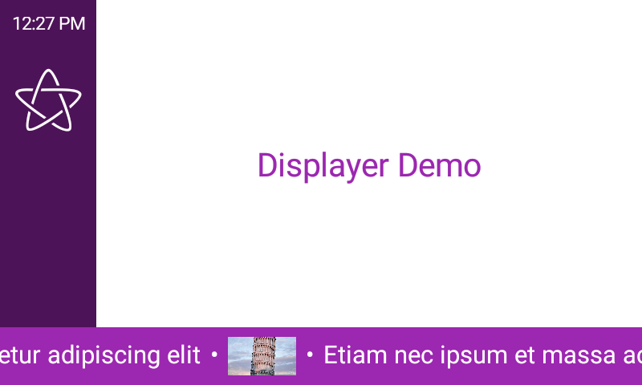

# Displayer

[](http://www.apache.org/licenses/LICENSE-2.0)
[](http://kotlinlang.org)
[](http://kotlinlang.org)

An open source multi-platform app for digital signage


## Table of contents

 * [Introduction](#introduction)
 * [Status](#status)
 * [Screenshots](#screenshots)
 * [Build and run](#build-and-run)
   * [Android](#android)
   * [Desktop](#desktop)
 * [Display file structure](#display-file-structure)
 * [Admin server](#admin-server)
   * [Start the admin server](#start-the-admin-server)
   * [Load a remote display file](#load-a-remote-display-file)
   * [Upload a local display file](#upload-a-local-display-file)
   * [Set OpenWeather API key](#set-openweather-api-key)
   * [Stop the admin server](#stop-the-admin-server)
 * [Android intents](#android-intents)
   * [Load a remote display file](#load-a-remote-display-file-1)
   * [Set OpenWeather API key](#set-openweather-api-key-1)
   * [Stop the admin server](#stop-the-admin-server-1)
 * [Android TV launcher](#android-tv-launcher)
 * [Built with](#built-with)
 * [License](#license)

## Introduction

The _Displayer_ app shows your content, described in a JSON file, in an endless loop, without any intervention, on the device of your choice.

Some of its features are:
 * Works on multiple platforms:
   * Android, including Android TV
   * Linux
   * Any other platform supported by Kotlin Multiplatform (KMP) 
 * Multiple _regions_
   * _Center_ region to show your main content
   * _Left_ and _Bottom_ region to show secondary (scrolling) content 
 * Different types of content:
   * Text
   * Images
   * Clock
   * Live weather information (requires an OpenWeather API key)
   * Random content
 * Locale-aware (for time formatting, temperature units,...)
 * Is a _launcher_ on Android platforms (including Android TV)

Displayer is being used successfully in the clubhouse of [korfbalclub KCBJ](https://www.kcbj.be/) to display information about upcoming events, sponsors, and live weather, without any intervention of the volunteer currently doing bar service.

## Status

This project is currently under heavy development and should be considered _alpha-quality_ at best. 

## Screenshots




[](https://www.youtube.com/watch?v=r9NUL9Qbw-c "Watch screen recording")

## Build and run

There are currently no binary builds available. You have to download/clone the source code and build the app to run it.

Building Displayer requires at minimum Java 17.

Optionally, you can open the project in IntelliJ IDEA (tested with version 2022.3.1 of the Community Edition running on Java 17)

### Android

 * Define `sdk.dir` in `local.properties` to point to your Android SDK location 
 * Execute `./gradlew assemble` to build the Android app
 * The resulting APK files will be placed in `android/build/outputs/apk`
 * Use [ADB](https://developer.android.com/studio/command-line/adb) to install the app on your Android device: `adb install android/build/outputs/apk/debug/android-debug.apk`

### Desktop

 * Execute `./gradlew package` to build the desktop apps
 * The resulting binaries will be placed in `desktop/build/compose/binaries`

## Display file structure

There are [sample display files](docs/samples/index.md) available showcasing different features.

A detailed explanation of the display file structure is coming soon...

## Admin server

Displayer has a built-in webserver that can be used to send commands and control the app from a remote device.
This server accepts commands sent via `curl`, `wget` or any web browser.

The admin server is *not* enabled by default.

### Start the admin server

#### Android

On Android, you'll need [ADB](https://developer.android.com/studio/command-line/adb) to start the admin server with the following command:

```
adb shell am start -a com.displayer.action.CONFIG -e com.displayer.extra.ADMIN_PORT YOUR_PORT -e com.displayer.extra.ADMIN_SECRET YOUR_SECRET
```

Replace YOUR_PORT with the TCP/IP port number to use for the admin server.

Replace YOUR_SECRET with a secret that must be included in any request to the admin port.

#### Desktop

On desktop, you must start Displayer with extra parameters to enable the admin server.

Example:
```
/opt/displayer/bin/Displayer --admin-port=YOUR_PORT --admin-secret=YOUR_SECRET
```

Replace YOUR_PORT with the TCP/IP port number to use for the admin server.

Replace YOUR_SECRET with a secret that must be included in any request to the admin port.

### Load a remote display file

```
curl "http://YOUR_HOST:YOUR_PORT/admin?secret=YOUR_SECRET&url=URL_OF_DISPLAY_FILE"
```

Replace URL_OF_DISPLAY_FILE with the URL of your own display file, e.g. https://example.com/displayer.json.
Make sure you URL-encode all special characters in the URL.

### Upload a local display file

```
curl -F 'data=@PATH_OF_DISPLAY_FILE' "http://YOUR_HOST:YOUR_PORT/admin/display?secret=YOUR_SECRET"
```

Replace PATH_OF_DISPLAY_FILE with the path of a local display file that will be uploaded.

### Set OpenWeather API key

```
curl "http://YOUR_HOST:YOUR_PORT/admin?secret=YOUR_SECRET&open-weather-api-key=YOUR_API_KEY"
```

Replace YOUR_API_KEY with your own OpenWeather API key obtained from the [OpenWeather API console](https://home.openweathermap.org/api_keys).

### Stop the admin server

```
curl "http://YOUR_HOST:YOUR_PORT/admin?secret=YOUR_SECRET&kill-server"
```

## Android intents

The Android app also accepts a number of _intents with extras_.

You can use [ADB](https://developer.android.com/studio/command-line/adb) to launch these intents.

### Load a remote display file
```
adb shell am start -a android.intent.action.VIEW -d "URL_OF_DISPLAY_FILE"
```

Replace URL_OF_DISPLAY_FILE with the URL of your own display file, e.g. https://example.com/displayer.json

### Set OpenWeather API key

```
adb shell am start -a com.displayer.action.CONFIG -e EXTRA_OPEN_WEATHER_API_KEY YOUR_API_KEY
```

Replace YOUR_API_KEY with your own OpenWeather API key obtained from the [OpenWeather API console](https://home.openweathermap.org/api_keys).

### Stop the admin server

```
adb shell am start -a com.displayer.action.KILL_SERVER
```

## Android TV launcher

After installing Displayer on Android TV, you can disable the original Android TV launcher.
This will make sure that Displayer automatically starts after rebooting your Android TV device.

To disable the original Android TV launcher enter the following commands:

```
adb shell pm disable-user --user 0 com.google.android.tvlauncher
adb shell pm disable-user --user 0 com.google.android.tungsten.setupwraith
```

You can always re-enable the original Android TV launcher by entering the following commands:

```
adb shell pm enable com.google.android.tvlauncher
adb shell pm enable com.google.android.tungsten.setupwraith
```

## Built with

 * [Kotlin Multiplatform](https://kotlinlang.org/docs/multiplatform.html)
 * [Compose Desktop](https://www.jetbrains.com/lp/compose-desktop/)
 * [Kotlin Serialization](https://kotlinlang.org/docs/serialization.html)
 * [Kotlin Date/Time](https://github.com/Kotlin/kotlinx-datetime)
 * [Ktor](https://ktor.io/): HTTP server
 * [Koin](https://github.com/InsertKoinIO/koin): dependency injection framework
 * [Kamel](https://github.com/alialbaali/Kamel): asynchronous media loading library for Compose
 * [Multiplatform settings](https://github.com/russhwolf/multiplatform-settings): Kotlin Multiplatform library to persist key-value data
 * [Kermit](https://github.com/touchlab/Kermit): Kotlin Multiplatform logging

# License

    Copyright 2022 Norio BV

    Licensed under the Apache License, Version 2.0 (the "License");
    you may not use this file except in compliance with the License.
    You may obtain a copy of the License at

       http://www.apache.org/licenses/LICENSE-2.0

    Unless required by applicable law or agreed to in writing, software
    distributed under the License is distributed on an "AS IS" BASIS,
    WITHOUT WARRANTIES OR CONDITIONS OF ANY KIND, either express or implied.
    See the License for the specific language governing permissions and
    limitations under the License.
