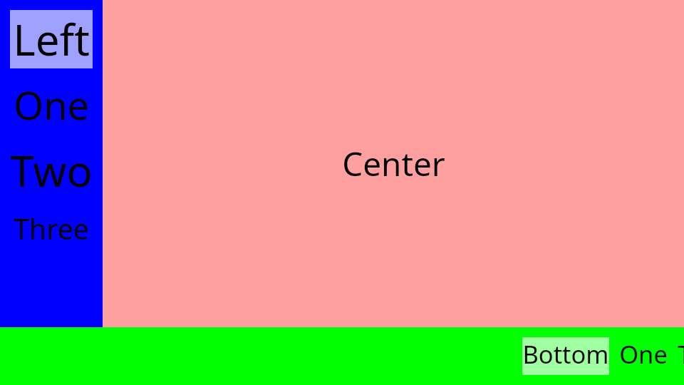
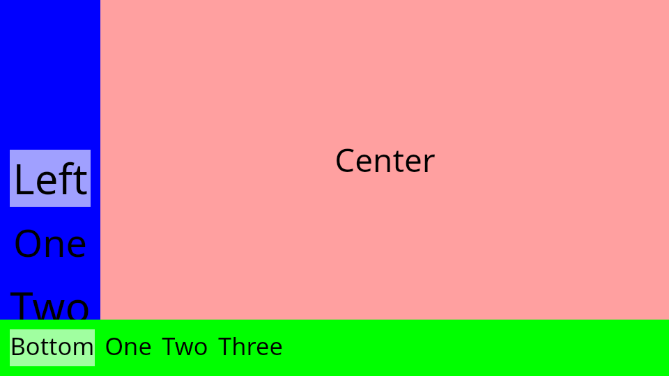
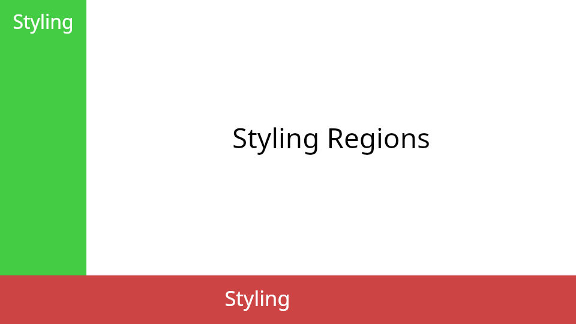
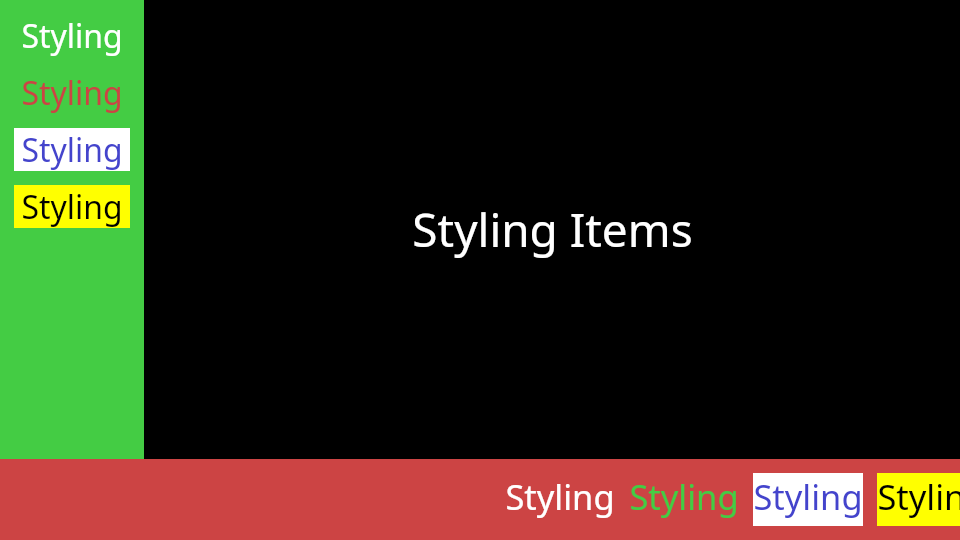
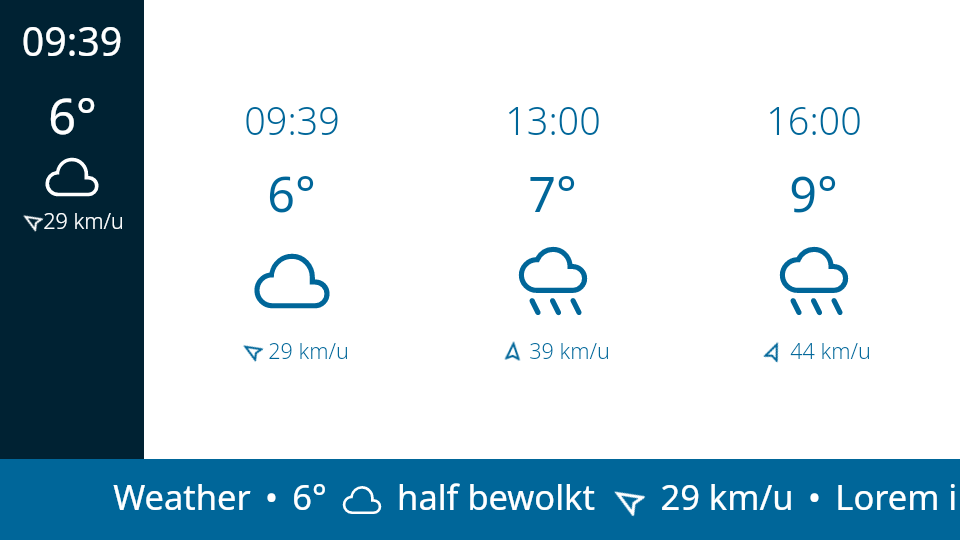
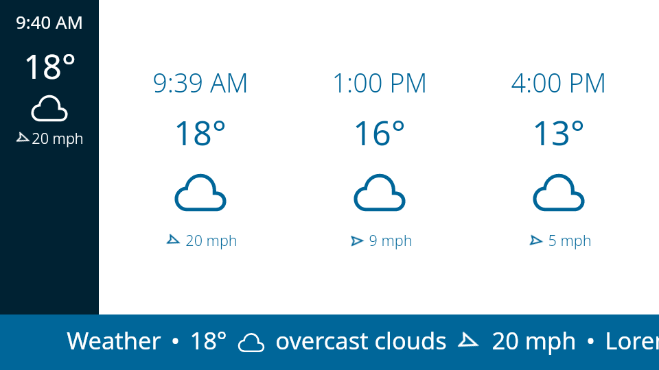
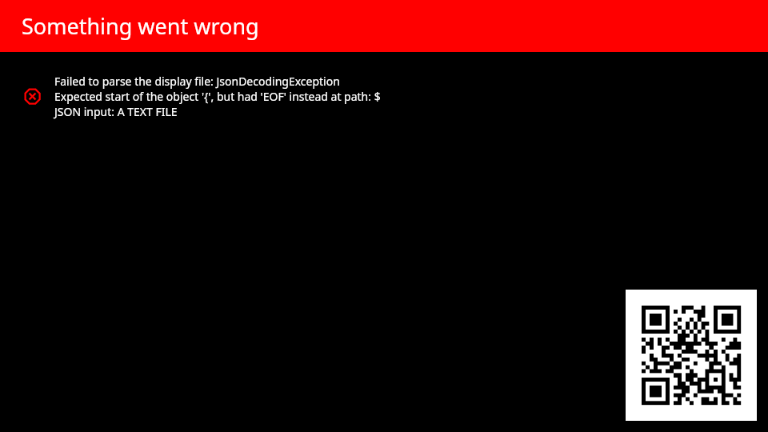
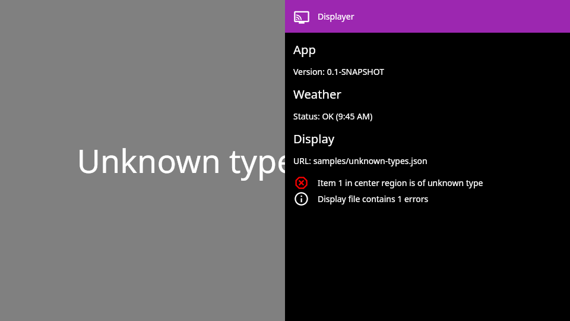
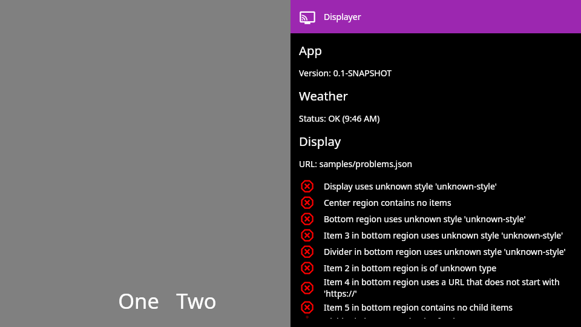

# Sample display files

### [text.json](text.json)
Simple text in the center region

## Regions

### [regions.json](regions.json)
Scrolling bottom region (ticker) and a static left region

### [regions-alternative.json](regions-alternative.json)
Static bottom region and a scrolling left region

## Styling

### [styles-regions.json](styles-regions.json)
Styling the different regions

### [styles-items.json](styles-items.json)
Styling individual items

## Images

### [images.json](images.json)
Images and the `scale` parameter

## Locale

### [locale_en_US.json](locale_en_US.json)
Clock showing time in the en_US locale (using a 12-hour time format)

### [locale_fi_FI.json](locale_fi_FI.json)
Clock showing time in the fi_FI locale (using a 24-hour time format with a dot separator)

### [locale_nl_BE.json](locale_nl_BE.json)
Clock showing time in the nl_BE locale (using a 24-hour time format with a colon separator)

## Weather

Require an OpenWeather API key.

### [weather_betekom_BE.json](weather_betekom_BE.json)
Live weather data for Betekom, Belgium, showing temperature in degrees Celsius and wind speeds in km/h (in Dutch)

### [weather_rochester_MN.json](weather_rochester_MN.json)
Live weather data for Rochester, Minnesota, US, showing temperature in degrees Fahrenheit and wind speeds in mph (in English).

## Errors

### [not-json.txt](json.json)
Invalid JSON

### [unknown-types.json](unknown-types.json)
Any unknown types are ignored

### [problems.json](problems.json)
Problems detected are reported in the UI

